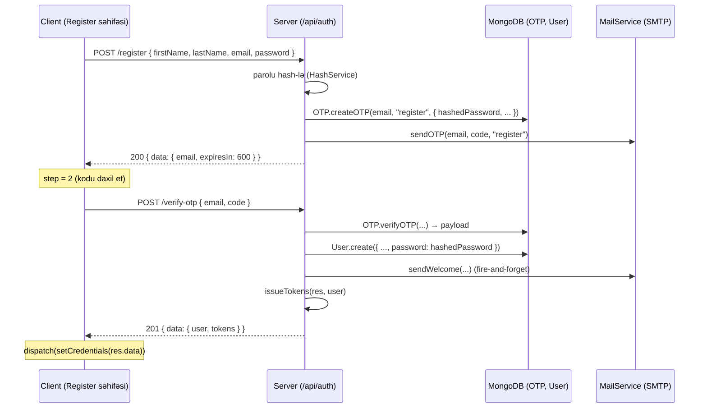
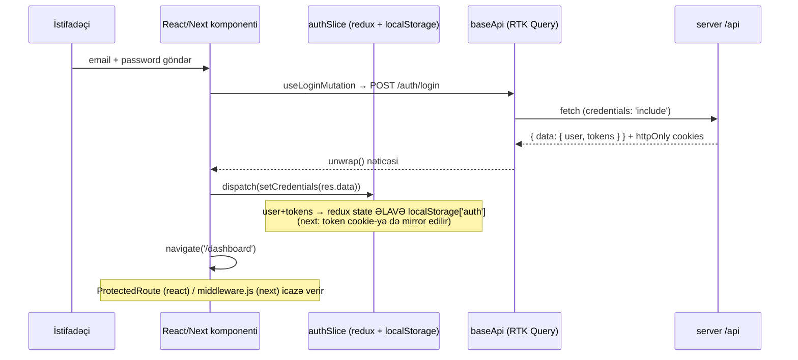
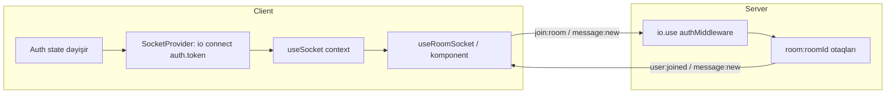

# 01 — Arxitektura (Architecture)

Bu sənəd `fullstack-starter` monorepo-sunun üç şablonunun (`server/`, `client-react/`, `client-next/`)
uçtan-uca (end-to-end) arxitekturasını izah edir. Bütün diaqram, yol və kod nümunələri diskdəki
**real fayllardan** götürülüb. Domen model olaraq generic **User + OTP + Post** istifadə olunur.

> Qısa xülasə: bir Express + Mongoose backend (`server/`) iki müxtəlif frontend (`client-react/` — Vite SPA,
> `client-next/` — Next.js App Router) tərəfindən eyni REST + Socket.IO müqaviləsi (contract) ilə istifadə olunur.

---

## 1. Üç-stack ümumi baxış

```
                         ┌─────────────────────────────────────┐
                         │              server/                 │
                         │   Express 5 + Mongoose 9 + Socket.IO │
                         │   REST: /api/*   WS: socket.io       │
                         └───────────────┬─────────────────────┘
                                         │  (eyni JSON envelope +
                                         │   eyni JWT müqaviləsi)
                  ┌──────────────────────┴───────────────────────┐
                  │                                               │
      ┌───────────▼─────────────┐                   ┌─────────────▼────────────┐
      │      client-react/      │                   │      client-next/        │
      │  Vite 8 SPA (CSR)       │                   │  Next.js 16 App Router   │
      │  react-router 8         │                   │  Server + Client Compo.  │
      │  RTK Query + Socket ctx │                   │  RTK Query + middleware  │
      └─────────────────────────┘                   └──────────────────────────┘
```

| Stack | Rol | Əsas texnologiyalar | Auth qorunması |
| --- | --- | --- | --- |
| `server/` | REST API + real-time backend | Express 5, Mongoose 9, Socket.IO 4, JWT | `authenticate` middleware (JWT + tokenVersion) |
| `client-react/` | Tək səhifəli tətbiq (SPA) | React 19, Vite 8, react-router 8, RTK Query | `<ProtectedRoute>` komponenti (client-side) |
| `client-next/` | SSR/App Router tətbiqi | Next.js 16, React 19, RTK Query | `middleware.js` (Edge) + mirror cookie |

Hər iki client eyni server envelope-unu gözləyir:

```jsonc
// Uğur
{ "success": true, "message": "...", "data": { /* ... */ } }
// Xəta
{ "success": false, "message": "...", "errors": [ /* optional */ ] }
```

---

## 2. Server request lifecycle (DƏQİQ middleware sırası)

Bütün middleware-lər `server/app.js` içində üç setup funksiyasında qeydiyyatdan keçir:
`setupSecurity(app)` → `setupMiddlewares(app)` → `setupRoutes(app)` → `setupErrorHandlers(app)`.
Aşağıdakı sıra `app.use(...)` çağırışlarının **faktiki icra sırasıdır**.

```
İstək (HTTP request)
   │
   ▼
┌───────────────────────────── setupSecurity(app) ─────────────────────────────┐
│ 1. helmet({ contentSecurityPolicy, crossOriginResourcePolicy, ... })          │
│ 2. securityHeaders   → X-Frame-Options: DENY, Referrer-Policy, X-Powered-By-i │
│                        silir (middlewares/security.js)                         │
│ 3. noCookies         → yalnız essential/httpOnly cookie-lərə icazə verir       │
└───────────────────────────────────────────────────────────────────────────────┘
   │
   ▼
┌──────────────────────────── setupMiddlewares(app) ───────────────────────────┐
│ 4. compression()                     → gzip                                    │
│ 5. cors(corsConfig)                  → whitelist origin + credentials: true    │
│ 6. fileUpload({ limits, abortOnLimit }) → multipart/form-data (BODY PARSER-dən│
│                                           ƏVVƏL olmalıdır)                      │
│ 7. express.json({ limit: '10mb' })                                             │
│ 8. express.urlencoded({ extended: true, limit: '10mb' })                       │
│ 9. sanitizeInput                     → NoSQL injection: $ ilə başlayan açarları │
│                                        req.body/query/params-dan silir          │
│ 10. app.use('/api', apiRateLimiter)  → 100 istək / 1 dəqiqə / IP               │
│ 11. app.use('/uploads', express.static('uploads'))                             │
└───────────────────────────────────────────────────────────────────────────────┘
   │
   ▼
┌──────────────────────────────── setupRoutes(app) ────────────────────────────┐
│ 12. /api/auth  → AuthRouter   (routes/authRoutes.js)                           │
│     /api/posts → PostRouter   (routes/postRoutes.js)                           │
│     /api/health → inline health check                                          │
│        │                                                                        │
│        ├── route-səviyyəli middleware (məs. loginRateLimiter, writeRateLimiter,│
│        │    authenticate) → controller                                          │
│        ▼                                                                         │
│     controller (asyncHandler ilə bükülüb)                                       │
│        → service (AuthTokenService, HashService, MailService, FileService...)   │
│        → model (Mongoose: User / OTP / Post)                                    │
│        → response envelope: res.json({ success, message, data })                │
└───────────────────────────────────────────────────────────────────────────────┘
   │
   ▼
┌───────────────────────────── setupErrorHandlers(app) ────────────────────────┐
│ 13. 404 handler  → { success: false, message: 'Endpoint not found' }          │
│ 14. Central error handler (err, req, res, _next):                              │
│     - ValidationError    → 400 + errors[]                                       │
│     - code 11000 (dup)   → 409                                                  │
│     - JWT/TokenExpired   → 401                                                  │
│     - default            → err.statusCode || 500                               │
└───────────────────────────────────────────────────────────────────────────────┘
   │
   ▼
Cavab (HTTP response, JSON envelope)
```

### 2.1 asyncHandler nümunəsi (utils/asyncHandler.js)

Hər controller `asyncHandler` ilə bükülür ki, `try/catch` təkrarlanmasın — atılan xətalar avtomatik
`next(err)`-ə ötürülür və mərkəzi error handler tuturur.

```js
// server/utils/asyncHandler.js
const asyncHandler = (fn) => (req, res, next) => {
  Promise.resolve(fn(req, res, next)).catch(next);
};
```

### 2.2 Rate limiter səviyyələri (middlewares/security.js)

| Limiter | Pəncərə | Limit | Harada |
| --- | --- | --- | --- |
| `apiRateLimiter` | 1 dəqiqə | 100 / IP | qlobal `/api` prefiksi (app.js) |
| `loginRateLimiter` | 15 dəqiqə | 10 / IP | `POST /api/auth/login` (authRoutes.js) |
| `writeRateLimiter` | 15 dəqiqə | 50 / IP | Post create/update/delete (postRoutes.js) |

### 2.3 Real controller → service → model axını (Post CRUD)

```
POST /api/posts
  → authenticate            (middlewares/auth.js: JWT doğrula, req.user təyin et)
  → writeRateLimiter        (middlewares/security.js)
  → postController.createPost   (asyncHandler ilə bükülüb)
       └── Post.create({ ..., author: req.user._id })   (models/post.model.js)
             └── pre('save') hook → slug avtomatik generasiya (EncryptionService.generateSlug)
       └── res.status(201).json({ success: true, message: 'Post created', data: { post } })
```

---

## 3. Auth flow (uçtan-uca)

### 3.1 Token müqaviləsi

- **Access token**: `15m`, `config.accessSecretKey` ilə imzalanır.
- **Refresh token**: `7d` (rememberMe olduqda `30d`), `config.refreshSecretKey` ilə.
- **Reset token**: `10m`, `config.encryptionKey` ilə, `purpose: 'reset-password'` sahəsi ilə.
- Payload forması bütün app boyu eynidir: `{ id, role, tokenVersion }`
  (`server/services/AuthTokenService.js`).
- `tokenVersion` "bütün cihazlardan çıxış" (logout all) mexanizmidir: `logout` və parol dəyişikliyi
  onu +1 artırır, köhnə tokenlər dərhal etibarsız olur (`middlewares/auth.js`-də yoxlanılır).

### 3.2 Login / Register → tokenlərin verilməsi

Server həm **httpOnly cookie** qoyur, həm də tokenləri **response body**-də qaytarır
(`controllers/authController.js` → `issueTokens`). Clientlər body-dəki tokenlərdən istifadə edir.

```js
// server/controllers/authController.js (issueTokens — qısaldılmış)
res.cookie(config.accessCookieName, tokens.accessToken, { ...config.cookie, maxAge: config.accessTokenMaxAge });
res.cookie(config.refreshCookieName, tokens.refreshToken, { ...config.cookie, maxAge: refreshMaxAge });
return tokens; // həmçinin res.json({ data: { user, tokens } }) içində qaytarılır
```

### 3.3 Register OTP axını (iki addım)



Client tərəfdə bu iki addım `RegisterPage` içində `step` state-i ilə idarə olunur
(`client-react/src/pages/public/RegisterPage/RegisterPage.jsx`), `useRegisterMutation` və
`useVerifyOTPMutation` hook-ları ilə.

### 3.4 Login → qorunan səhifə (tam dövr)



### 3.5 401 → refresh → retry (reauth wrapper)

`baseQueryWithReauth` hər iki clientdə eynidir (`store/api/baseApi.js`). 401 alındıqda bir dəfə
refresh cəhd edilir, uğurlu olsa orijinal istək təkrarlanır, əks halda logout olunur.

```
İstək → baseQuery
   │
   ▼ 401?
   ├── xeyr → nəticəni qaytar
   └── bəli → state.auth.refreshToken varmı?
              ├── yox  → dispatch(auth/logout)
              └── var  → POST /auth/refresh (Authorization: Bearer <refreshToken>)
                          │
                          ├── data → dispatch(auth/setTokens, data.data.tokens)
                          │           → orijinal istəyi TƏKRAR icra et
                          └── error → dispatch(auth/logout)
```

Serverdə `/auth/refresh` marşrutu `authenticateRefreshToken` middleware-i ilə qorunur; o, refresh
tokeni `refreshSecretKey` ilə doğrulayır və `tokenVersion` uyğunluğunu yoxlayır
(`server/middlewares/auth.js`).

### 3.6 Client-side qorunma fərqi

| | client-react | client-next |
| --- | --- | --- |
| Mexanizm | `<ProtectedRoute>` komponenti | `middleware.js` (Edge runtime) |
| Yoxlanan | `state.auth.isAuthenticated` (redux) | `token` adlı cookie-nin mövcudluğu |
| Cookie mirror | yoxdur | `authSlice.setTokenCookie` access tokeni `token` cookie-yə yazır |
| Fayl | `client-react/src/components/ProtectedRoute.jsx` | `client-next/middleware.js` + `client-next/src/store/slices/authSlice.js` |

> **Vacib qeyd:** `client-next`-də localStorage Edge middleware tərəfindən oxunmur. Buna görə `authSlice`
> access tokeni `token` adlı, oxunabilən (SameSite=Lax) cookie-yə **mirror** edir. `middleware.js` yalnız
> bu cookie-nin varlığını yoxlayır — bu, UX guard-dır, real təhlükəsizlik sərhədi deyil; əsl authorization
> həmişə API serverində baş verir.

---

## 4. RTK Query data flow (client)

Hər iki client eyni struktura malikdir: `baseApi` (createApi) → feature endpoint faylları
(`authApi`, `postApi`) `injectEndpoints` ilə qoşulur → komponent avtogenerasiya olunmuş hook-ları
(`useXQuery` / `useXMutation`) çağırır.

```
Komponent (məs. PostsPage)
   │  useGetPostsQuery({ limit: 50 })
   ▼
authApi/postApi (injectEndpoints)
   │  builder.query / builder.mutation
   ▼
baseApi (createApi, reducerPath: 'api', tagTypes: ['User','Post','Auth'])
   │  baseQuery = baseQueryWithReauth
   ▼
baseQueryWithReauth
   │  prepareHeaders → Authorization: Bearer <state.auth.accessToken>
   │  401 → /auth/refresh → retry (bax §3.5)
   ▼
fetchBaseQuery({ baseUrl: `${API_URL}/api`, credentials: 'include' })
   ▼
server /api/*
```

Kod nümunəsi (`client-react/src/store/api/baseApi.js`):

```js
const baseQuery = fetchBaseQuery({
  baseUrl: `${import.meta.env.VITE_API_URL || 'http://localhost:5000'}/api`,
  credentials: 'include',
  prepareHeaders: (headers, { getState }) => {
    if (!headers.get('Authorization')) {
      const token = getState().auth?.accessToken
      if (token) headers.set('Authorization', `Bearer ${token}`)
    }
    return headers
  },
})
```

Yeganə fərq base URL mənbəyidir: react `import.meta.env.VITE_API_URL`, next
`process.env.NEXT_PUBLIC_API_URL` istifadə edir.

### 4.1 Cache invalidation (tags)

`postApi` LIST + per-item tag pattern-i istifadə edir: query `providesTags`, mutation `invalidatesTags`.

```js
// client-*/src/store/api/postApi.js — createPost
invalidatesTags: [{ type: 'Post', id: 'LIST' }],
// updatePost / deletePost
invalidatesTags: (result, error, { id }) => [{ type: 'Post', id }, { type: 'Post', id: 'LIST' }],
```

---

## 5. Socket.IO flow (hər iki tərəf)

### 5.1 Server: SocketService (rooms)

`server/services/SocketService.js` singleton-dur. `app.js` içində `socketService.init(httpServer)`
ilə işə düşür. Handshake-də `auth.token` doğrulanır (`authMiddleware`), otaqlar `room:${roomId}`
adlanır.

Server dinlədiyi hadisələr (client → server): `join:room`, `leave:room`, `typing:start`,
`typing:stop`, `message:new`.
Server yaydığı hadisələr (server → client): `user:joined`, `user:left`, `user:typing`,
`user:stopped_typing`, `message:new`.

```js
// server/services/SocketService.js (qısaldılmış)
this.io.use(this.authMiddleware.bind(this)); // handshake.auth.token → jwt.verify
socket.on("join:room", (roomId) => this.joinRoom(socket, roomId)); // socket.join(`room:${roomId}`)
socket.on("message:new", ({ roomId, message }) =>
  this.io.to(`room:${roomId}`).emit("message:new", { roomId, message, userId, sentAt }));
```

Server həmçinin kod tərəfindən yayım üçün `emitToRoom(roomId, event, data)` və
`emitToUser(userId, event, data)` metodları təqdim edir.

### 5.2 Client: SocketContext + useRoomSocket

```
Auth state (accessToken, user)
   │  dəyişəndə
   ▼
SocketProvider (store/context/SocketContext.jsx)
   │  io(SOCKET_URL, { auth: { token: accessToken }, transports: ['websocket','polling'] })
   │  connect/disconnect/connect_error event-ləri isConnected state-ni idarə edir
   ▼
useSocket() → { socket, isConnected, joinRoom, leaveRoom, startTyping, stopTyping, sendMessage }
   ▼
useRoomSocket(roomId, { onMessage, onUserTyping, onUserStoppedTyping })   // yalnız client-react
   │  mount: joinRoom(roomId) + socket.on('message:new' / 'user:typing' / 'user:stopped_typing')
   │  unmount: leaveRoom(roomId) + socket.off(...)
```



> **Qeyd:** Hər iki client-də `sendMessage` `socket.emit('message:new', { roomId, message })` yayır və server
> də (`SocketService.js`) məhz `message:new` dinləyib otağa yenidən yayımlayır — yəni emit/listen adları hər üç
> tərəfdə eynidir. `useRoomSocket` (react) də `message:new` dinləyir. Yeni real-time hadisə əlavə edərkən eyni
> prinsipi saxla: client emit adı ↔ server `socket.on(...)` adı ↔ server broadcast adı uyğun olmalıdır.

### 5.3 Provider iyerarxiyası

- **client-react** (`src/App.jsx`): `HelmetProvider` → `Provider store` → `SocketProvider` → `AppRouter`.
  Socket Redux state-ə ehtiyac duyduğu üçün `Provider`-in içindədir.
- **client-next** (`src/app/providers.jsx`): `Provider store` → `SocketProvider` → `children`.
  `providers.jsx` `'use client'`-dir və root `layout.js` (Server Component) tərəfindən render olunur.

---

## 6. Konfiqurasiya mənbələri (environment)

| Dəyər | server | client-react | client-next |
| --- | --- | --- | --- |
| API base URL | `PORT`, `config.development.port` | `VITE_API_URL` | `NEXT_PUBLIC_API_URL` |
| Site URL (SEO) | `config.clientUrl` | `VITE_SITE_URL` | `NEXT_PUBLIC_SITE_URL` |
| DB | `MONGODB_URI` / `DB_*` | — | — |
| JWT gizli açarları | `ACCESS/REFRESH/ENCRYPTION_KEY` | — | — |
| SMTP | `SMTP_*` | — | — |

Server konfiqurasiyası `server/config/config.js`-də mərkəzləşdirilib; `NODE_ENV=production` olduqda
`app.js` içindəki `validateEnv()` default gizli açarların işlədilməsinə icazə vermir (prosesi dayandırır).
